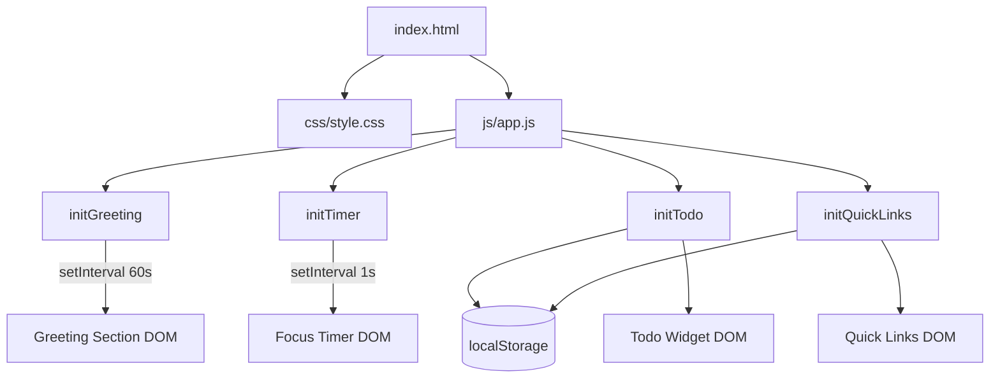
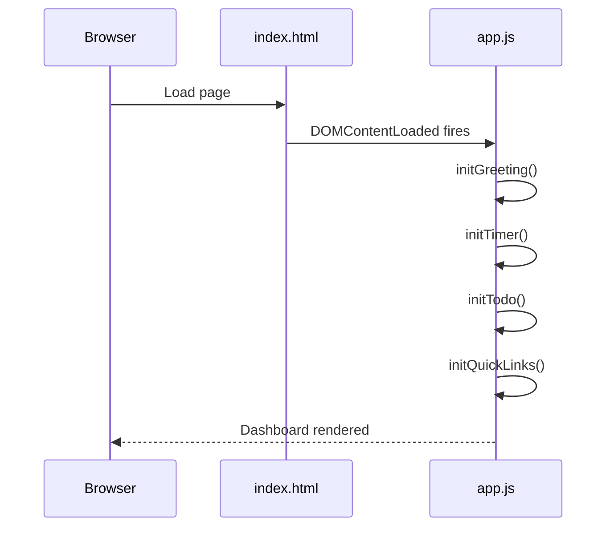
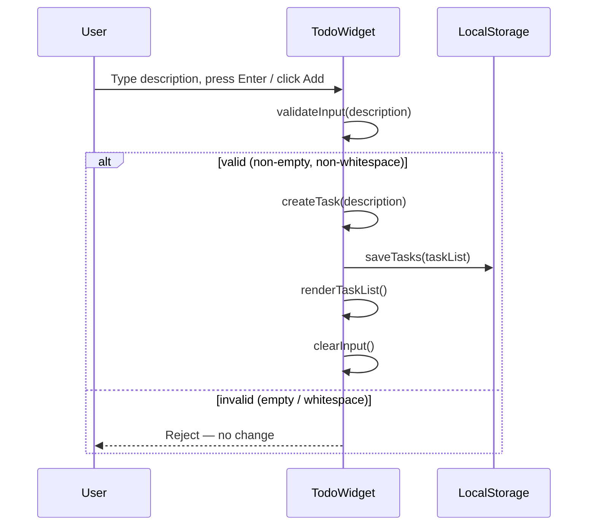
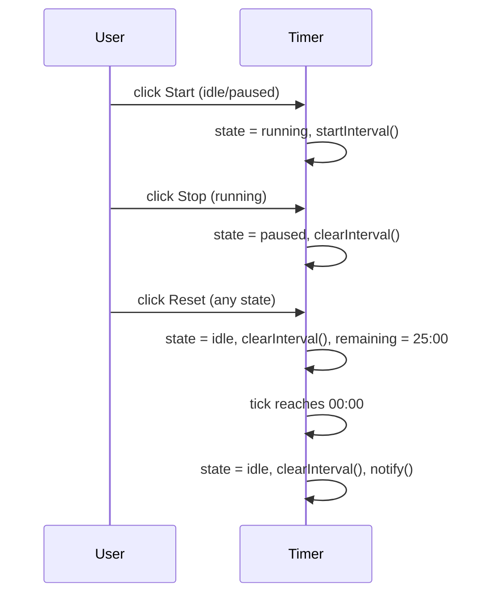

# Design Document: To-Do List Life Dashboard

## Overview

The To-Do List Life Dashboard is a single-page web application built entirely with HTML, CSS, and Vanilla JavaScript. It renders four productivity widgets — a time-aware Greeting Section, a Pomodoro-style Focus Timer, a persistent To-Do List, and a Quick Links launcher — inside a responsive dashboard grid. All user data is stored in the browser's `localStorage`; there is no server, no build step, and no external dependency.

The entire client-side logic lives in `js/app.js`, organized as a collection of `init*` functions (one per widget) that are invoked once on `DOMContentLoaded`. CSS custom properties drive theming; the layout uses CSS Grid with a two-column, two-row arrangement that collapses to a single column on narrow viewports.

## Architecture



## Sequence Diagrams

### App Bootstrap



### To-Do Add Task Flow



### Focus Timer State Transitions



## Components and Interfaces

### Component 1: Greeting Section (`initGreeting`)

**Purpose**: Displays the current time, date, and a contextual greeting. Refreshes on a 60-second interval.

**Interface** (JS functions):
```javascript
function initGreeting()          // Entry point — renders once, then schedules updates
function renderGreeting()        // Updates #greeting-time, #greeting-date, #greeting-text
function getGreetingText(hour)   // Returns "Good Morning" | "Good Afternoon" | "Good Evening"
function formatTime(date)        // Returns HH:MM string (12-hour with AM/PM)
function formatDate(date)        // Returns "Weekday, Month DD" string
```

**Responsibilities**:
- Call `renderGreeting()` immediately on init, then every 60 000 ms via `setInterval`
- Map the current hour to the correct greeting phrase
- Write formatted strings into the DOM (no side effects beyond DOM mutation)

**Key DOM Elements**:
```html
<section id="greeting-widget">
  <h1 id="greeting-text">Good Morning</h1>
  <p id="greeting-time">08:42 AM</p>
  <p id="greeting-date">Monday, June 16</p>
</section>
```

---

### Component 2: Focus Timer (`initTimer`)

**Purpose**: Manages a 25-minute countdown with Start, Stop, and Reset controls. Enforces a simple state machine.

**Timer State Machine**:

| State   | Start btn | Stop btn | Reset btn | Tick behavior       |
|---------|-----------|----------|-----------|---------------------|
| idle    | enabled   | disabled | enabled   | no interval running |
| running | disabled  | enabled  | enabled   | decrement each sec  |
| paused  | enabled   | disabled | enabled   | no interval running |

**Interface** (JS functions):
```javascript
function initTimer()             // Entry point — sets initial state, binds controls
function startTimer()            // state → running, create setInterval tick
function stopTimer()             // state → paused, clearInterval
function resetTimer()            // state → idle, clearInterval, remaining = 1500s
function tickTimer()             // decrement remaining; if 0 → notify + reset
function renderTimer(seconds)    // Updates #timer-display as MM:SS
function updateTimerControls()   // Enable/disable buttons based on current state
function notifyTimerEnd()        // browser alert("Time's up!")
```

**Timer state** is stored as a plain object in module scope:
```javascript
const timerState = {
  remaining: 1500,   // seconds (25 × 60)
  status: 'idle',    // 'idle' | 'running' | 'paused'
  intervalId: null
};
```

**Key DOM Elements**:
```html
<section id="timer-widget">
  <div id="timer-display">25:00</div>
  <div id="timer-controls">
    <button id="btn-start">Start</button>
    <button id="btn-stop"  disabled>Stop</button>
    <button id="btn-reset">Reset</button>
  </div>
</section>
```

---

### Component 3: To-Do List (`initTodo`)

**Purpose**: Full CRUD management of tasks, with immediate Local Storage persistence and event delegation for dynamic items.

**Interface** (JS functions):
```javascript
function initTodo()                  // Entry point — load from LS, render, bind static events
function loadTasks()                 // Returns Task[] from localStorage (or [])
function saveTasks(tasks)            // Serialises Task[] to localStorage; returns boolean
function renderTaskList(tasks)       // Rebuilds #task-list ul from tasks array
function createTask(description)     // Returns new Task object {id, description, completed}
function addTask(description)        // Validate → createTask → save → render → clearInput
function deleteTask(id)              // Remove from array → save → render (revert on fail)
function toggleTask(id)              // Flip completed → save → render
function startEditTask(id)           // Replace text node with input field + save/cancel btns
function confirmEditTask(id, value)  // Validate → update → save → render
function cancelEditTask()            // Re-render without changes
function validateDescription(str)    // Returns true if str.trim().length > 0
```

**Event Delegation** — a single `click` listener on `#task-list` dispatches to the correct handler based on `event.target.dataset.action` and `event.target.dataset.id`:

```javascript
document.getElementById('task-list').addEventListener('click', (e) => {
  const { action, id } = e.target.dataset;
  if (action === 'delete') deleteTask(id);
  if (action === 'toggle') toggleTask(id);
  if (action === 'edit')   startEditTask(id);
  if (action === 'save')   confirmEditTask(id, /* sibling input value */);
  if (action === 'cancel') cancelEditTask();
});
```

**Key DOM Elements**:
```html
<section id="todo-widget">
  <form id="add-task-form">
    <input id="task-input" type="text" placeholder="Add a task…" autocomplete="off" />
    <button type="submit">Add</button>
  </form>
  <ul id="task-list"></ul>
</section>
```

**Rendered Task Item**:
```html
<li data-id="abc123">
  <button data-action="toggle" data-id="abc123">✓</button>
  <span class="task-description">Buy groceries</span>
  <button data-action="edit"   data-id="abc123">✏</button>
  <button data-action="delete" data-id="abc123">✕</button>
</li>
```

---

### Component 4: Quick Links (`initQuickLinks`)

**Purpose**: Manages a collection of label+URL pairs rendered as launch buttons, with add and delete controls.

**Interface** (JS functions):
```javascript
function initQuickLinks()              // Entry point — load from LS, render, bind form
function loadLinks()                   // Returns QuickLink[] from localStorage (or [])
function saveLinks(links)              // Serialises QuickLink[] to localStorage
function renderLinks(links)            // Rebuilds #link-list from links array
function addLink(label, url)           // Validate → createLink → save → render → clearInputs
function deleteLink(id)                // Remove → save → render
function createLink(label, url)        // Returns {id, label, url}
function validateLink(label, url)      // Returns true if both label and url are non-empty
```

**Event delegation** on `#link-list` for delete buttons, same `data-action` / `data-id` pattern as the Todo widget.

**Key DOM Elements**:
```html
<section id="links-widget">
  <form id="add-link-form">
    <input id="link-label" type="text"  placeholder="Label" />
    <input id="link-url"   type="url"   placeholder="https://…" />
    <button type="submit">Add</button>
  </form>
  <div id="link-list"></div>
</section>
```

**Rendered Link Item**:
```html
<div class="link-item" data-id="xyz789">
  <a href="https://example.com" target="_blank" rel="noopener">Example</a>
  <button data-action="delete" data-id="xyz789">✕</button>
</div>
```

## Data Models

### Task

```javascript
// localStorage key: 'tasks'
// Stored as JSON array of Task objects
{
  id: String,          // crypto.randomUUID() or Date.now().toString()
  description: String, // trimmed, non-empty
  completed: Boolean   // false on creation
}
```

**Validation Rules**:
- `description.trim().length > 0` — required for creation and editing
- `id` is immutable once assigned
- `completed` defaults to `false`

**Example localStorage entry**:
```json
[
  { "id": "1718500000000", "description": "Buy groceries", "completed": false },
  { "id": "1718500001000", "description": "Read 20 pages", "completed": true }
]
```

### QuickLink

```javascript
// localStorage key: 'quickLinks'
// Stored as JSON array of QuickLink objects
{
  id: String,   // crypto.randomUUID() or Date.now().toString()
  label: String, // non-empty display name
  url: String    // non-empty URL (user-supplied, opened as-is)
}
```

**Validation Rules**:
- `label.trim().length > 0` — required
- `url.trim().length > 0` — required
- No URL format enforcement at the data layer (browser handles bad URLs gracefully)

**Example localStorage entry**:
```json
[
  { "id": "1718500002000", "label": "GitHub", "url": "https://github.com" },
  { "id": "1718500003000", "label": "MDN",    "url": "https://developer.mozilla.org" }
]
```

### Local Storage Key Summary

| Key          | Value Type    | Widget            |
|-------------|---------------|-------------------|
| `tasks`      | JSON string → Task[]      | Todo_Widget        |
| `quickLinks` | JSON string → QuickLink[] | Quick_Links_Widget |

## CSS Approach

### Custom Properties (Design Tokens)

```css
:root {
  /* Colors */
  --color-bg:        #1a1a2e;
  --color-surface:   #16213e;
  --color-accent:    #0f3460;
  --color-highlight: #e94560;
  --color-text:      #eaeaea;
  --color-muted:     #888;

  /* Spacing */
  --space-sm: 0.5rem;
  --space-md: 1rem;
  --space-lg: 1.5rem;

  /* Radii */
  --radius-md: 8px;

  /* Timer font size */
  --timer-font-size: 3rem;
}
```

### Layout

```css
/* Dashboard grid — 2 columns, 2 rows */
#dashboard {
  display: grid;
  grid-template-columns: 1fr 1fr;
  grid-template-rows: auto auto;
  gap: var(--space-lg);
  padding: var(--space-lg);
}

/* Responsive collapse */
@media (max-width: 680px) {
  #dashboard {
    grid-template-columns: 1fr;
  }
}
```

Widgets are placed in reading order: Greeting (top-left), Timer (top-right), To-Do (bottom-left), Quick Links (bottom-right). Each widget is a `<section>` styled as a card with `background: var(--color-surface)`, padding, and `border-radius: var(--radius-md)`.

### Task Completion Style

```css
.task-completed .task-description {
  text-decoration: line-through;
  color: var(--color-muted);
}
```

## Error Handling

### Error Scenario 1: localStorage Write Failure

**Condition**: `localStorage.setItem()` throws (e.g., storage quota exceeded).  
**Response**: `saveTasks()` / `saveLinks()` wrap the call in `try/catch` and return `false`.  
**Recovery**:
- For **delete task**: caller reverts the in-memory array and re-renders (Requirement 8.3).
- For **edit task**: caller reverts the description field and re-renders (Requirement 6.5).
- For **toggle task** and **add task**: no revert; in-memory state is kept (Requirements 7.4, 5.4 — best-effort persistence).

### Error Scenario 2: Malformed localStorage Data

**Condition**: `localStorage.getItem()` returns a non-JSON string or `null`.  
**Response**: `loadTasks()` / `loadLinks()` wrap `JSON.parse()` in `try/catch` and fall back to `[]`.  
**Recovery**: Widget renders an empty list and overwrites corrupted data on the next write.

### Error Scenario 3: Timer Already Running

**Condition**: User clicks Start while the timer is already in the `running` state.  
**Response**: The Start button is disabled while `status === 'running'`; duplicate activation is structurally impossible.

## Testing Strategy

### Unit Testing Approach

The app uses no test framework (constraint: no external dependencies). Testing is performed manually in-browser using browser DevTools, supplemented by the property tests below.

Key scenarios to verify manually:
- Greeting text is correct at hours 0, 5, 12, 18, and 23.
- Timer counts down accurately and stops at 00:00.
- Whitespace-only task/link inputs are rejected.
- Edit → cancel restores original description.
- localStorage data survives page reload.

### Property-Based Testing Approach

Property tests are conceptual specifications; they are implemented inline in `app.js` as `console.assert()` statements or a lightweight test helper during development, then removed for production.

**Property Test Concepts**:
1. **Greeting range coverage** — `getGreetingText(h)` returns a non-empty string for every integer `h` in [0, 23].
2. **Timer format** — `renderTimer(s)` produces a string matching `/^\d{2}:\d{2}$/` for every integer `s` in [0, 1500].
3. **Task round-trip** — `loadTasks(saveTasks(tasks))` returns a list equivalent to `tasks` for any valid Task[].
4. **Whitespace rejection** — `validateDescription(s)` returns `false` for any string where `s.trim() === ''`.

### Integration Testing Approach

End-to-end flows verified by running the app in a browser and checking LocalStorage via DevTools:
- Add tasks → reload → tasks persist.
- Add links → reload → links persist.
- Complete session with timer reaching 00:00.

## Performance Considerations

- **setInterval overhead is negligible**: only two intervals run simultaneously at steady state (greeting: 60 s, timer: 1 s when active).
- **DOM rebuilds are full re-renders** (replace innerHTML) for simplicity. With typical task/link counts (< 100 items), this is imperceptible.
- **No debounce needed** for input events; only form submission triggers writes.

## Security Considerations

- **XSS**: All task descriptions and link labels are inserted via `textContent` (not `innerHTML`) to prevent script injection.
- **URL safety**: Quick Link URLs are assigned to `<a href>` only; `target="_blank"` is paired with `rel="noopener"` to prevent tab-napping.
- **No user authentication** is required; data is local to the browser.

## Dependencies

None. The application requires only a modern browser supporting:
- `localStorage` API
- `setInterval` / `clearInterval`
- `Date` object
- CSS Grid
- `crypto.randomUUID()` (or fallback to `Date.now().toString()`)

---

## Correctness Properties

*A property is a characteristic or behavior that should hold true across all valid executions of a system — essentially, a formal statement about what the system should do. Properties serve as the bridge between human-readable specifications and machine-verifiable correctness guarantees.*

### Property 1: Greeting covers all hours

*For any* integer hour value in the range [0, 23], `getGreetingText(hour)` SHALL return exactly one of "Good Morning", "Good Afternoon", or "Good Evening" — never an empty string, never undefined.

**Validates: Requirements 2.1, 2.2, 2.3, 2.4**

### Property 2: Timer display format invariant

*For any* integer `seconds` value in [0, 1500], `renderTimer(seconds)` SHALL produce a string matching the pattern `MM:SS` where MM and SS are zero-padded two-digit numbers.

**Validates: Requirements 3.1, 3.3**

### Property 3: Task persistence round-trip

*For any* valid array of Task objects, calling `saveTasks(tasks)` then `loadTasks()` SHALL return an array equivalent to the original (same ids, descriptions, and completed states, in the same order).

**Validates: Requirements 5.4, 6.4, 7.3, 8.2, 9.1**

### Property 4: Whitespace task rejection

*For any* string `s` whose trimmed form is empty (`s.trim() === ''`), `validateDescription(s)` SHALL return `false`, and calling `addTask(s)` SHALL leave the Task_List unchanged.

**Validates: Requirements 5.3, 6.3**

### Property 5: Quick Link persistence round-trip

*For any* valid array of QuickLink objects, calling `saveLinks(links)` then `loadLinks()` SHALL return an array equivalent to the original (same ids, labels, and URLs, in the same order).

**Validates: Requirements 10.1, 11.3, 12.2**

### Property 6: Quick Link validation rejects empty fields

*For any* pair `(label, url)` where either `label.trim() === ''` or `url.trim() === ''`, `validateLink(label, url)` SHALL return `false`, and `addLink(label, url)` SHALL leave the Quick_Links list unchanged.

**Validates: Requirements 11.2**

### Property 7: Timer state machine control consistency

*For any* timer state (`idle`, `running`, `paused`), after calling `updateTimerControls()`, the Start button SHALL be enabled if and only if `status !== 'running'`, and the Stop button SHALL be enabled if and only if `status === 'running'`.

**Validates: Requirements 4.4, 4.5**

### Property 8: Task toggle idempotence-pair

*For any* task, calling `toggleTask(id)` twice in succession SHALL return the task's `completed` field to its original value.

**Validates: Requirements 7.1, 7.3**
